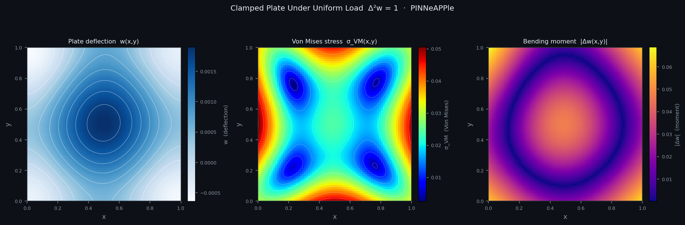
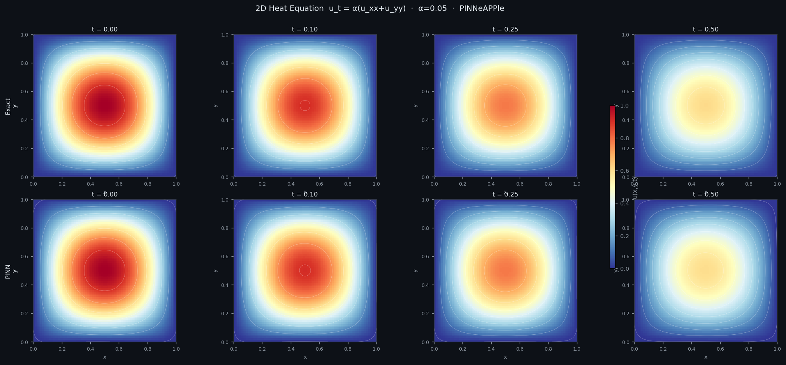
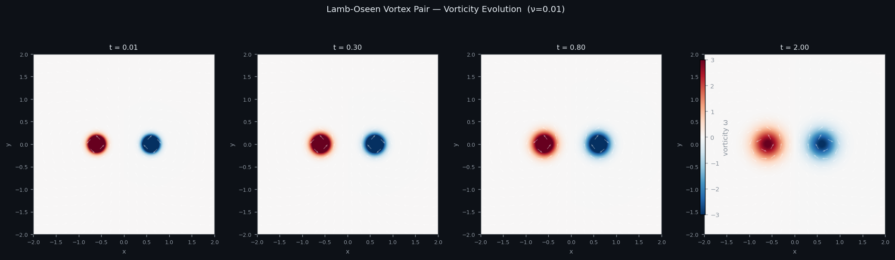
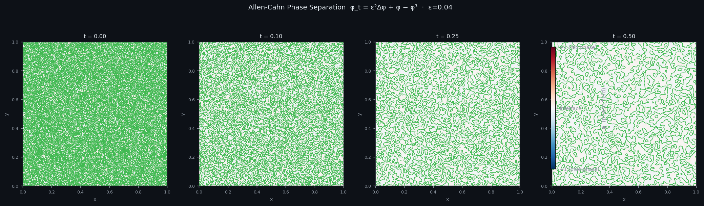
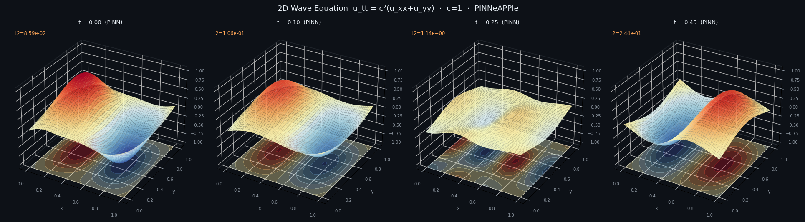
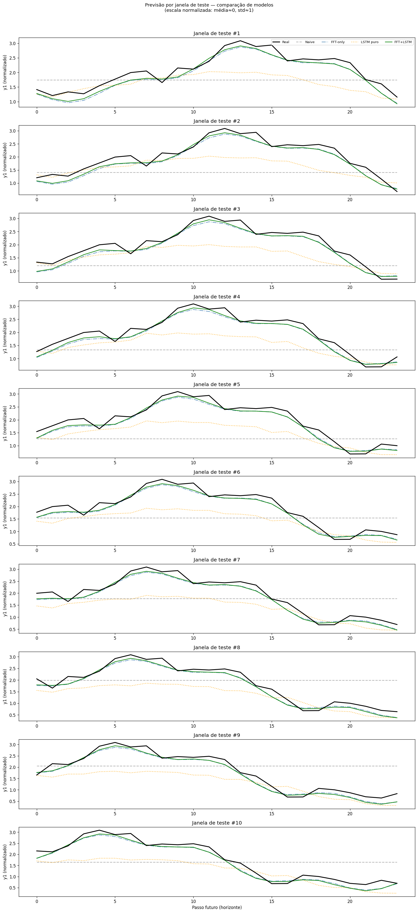

# PINNeAPPle 🍍
### Your Physics AI Laboratory — from first principles to real-world systems

> *Experiment. Learn. Build. Then scale — anywhere.*

PINNeAPPle is an open-source **Physics AI research and experimentation platform** designed to take you from your first physics-informed neural network all the way to **robust, production-ready solutions** — independent of any specific framework, vendor, or ecosystem.

<div align="center">

| | |
|:---:|:---:|
|  |  |
| *Clamped Plate — deflection, Von Mises stress & bending moment* | *2D Heat Equation — Exact vs PINN across time steps* |
|  |  |
| *Lamb-Oseen Vortex Pair — vorticity evolution* | *Allen-Cahn Phase Separation — interface dynamics* |

</div>

---

## Why PINNeAPPle?

Modern Physics AI ecosystems are powerful — but they assume you already understand:

- How to formulate physical problems correctly
- Which architectures to use (PINNs, operators, surrogates…)
- How to validate physics consistency
- How to benchmark and trust your results

**PINNeAPPle is where you build that foundation.**

```
Your physics problem
        ↓
  [ PINNeAPPle ]   ← experiment freely here
    Understand the physics
    Try architectures
    Compare approaches
    Validate results
    Build intuition
        ↓
[ Your Target Stack ]
  (custom infra, HPC, cloud, internal platform, etc.)
  Scale, deploy, integrate
```

---

## Package Structure

PINNeAPPle is organized into **8 mega-modules**, each grouping related sub-modules:

```
pinneapple_physics/
├── pde_environment/    # PDE problem specs, BCs, ICs, presets, RANS
├── pinn_solver/        # PINN compiler, DoMINO domain decomposition
└── symbolic_pde/       # SymPy → autograd residual compiler

pinneapple_neural/
├── architectures/      # SIREN, ModifiedMLP, AFNO, HashGridMLP, MeshGraphNet
├── trainer/            # Trainer, TwoPhase, DDP, Causal, HPC utilities
└── predictor/          # Batched inference, grid evaluation, FlowVisualizer

pinneapple_analysis/
├── uncertainty/        # MC-Dropout, Ensemble UQ, conformal, calibration
├── validation/         # Conservation, BC, symmetry checks vs. reference
└── inverse_problems/   # Noise models, regularizers, EKI, SINDy discovery

pinneapple_adaptation/
├── transfer_learning/  # Fine-tuning, layer freezing, progressive unfreezing
└── meta_learning/      # MAML, Reptile, PDETaskSampler, few-shot adaptation

pinneapple_simulation/
├── numerical_solvers/  # FEM, FDM, FVM, Spectral, SPH, LBM, OpenFOAM, FEniCS
├── particle_dynamics/  # MPM, SPH particles, rigid-body (pure PyTorch)
└── external_solvers/   # OpenFOAM, MATLAB, FMU/Modelica, FEniCS bridges

pinneapple_systems/
├── time_series/        # LSTM, GRU, NBeats, TFT, TCN, XGBoost, HHT, FFT
├── cosimulation/       # Graph co-sim engine: PINNNode, CoSimGraph, CoSimTrainer
└── digital_twin/       # Live twin, sensor streams, EKF/EnKF, anomaly detection

pinneapple_design/
├── geometry/           # SDF library, CSG, physics domains, mesh, NACA airfoil
└── design_optimizer/   # Adjoint, Pareto, Bayesian/evolutionary optimization

pinneapple_tools/
├── visualization/      # CFD-style plots, streamlines, Q-criterion, animations
├── model_export/       # TorchScript, ONNX, CSV, NPZ
├── hpo_experiments/    # Paper discovery, knowledge base, HPO
├── benchmark_suite/    # Arena, leaderboards, transfer/meta benchmark pipelines
└── compute_backends/   # PyTorch (default) + JAX backend abstraction
```

Additional packages: `pinneapple_data` (UPD dataset), `pinneapple_pdb` (physics database), `pinneapple_problemdesign` (NLP → PDE agent).

---

## Installation

```bash
pip install pinneapple
```

With optional extras:

```bash
pip install "pinneapple[solvers]"      # numba-accelerated FDM/FEM/LBM
pip install "pinneapple[pinn]"         # SymPy symbolic PDE compiler
pip install "pinneapple[geom]"         # trimesh, meshio, gmsh
pip install "pinneapple[fenics]"       # FEniCS / DOLFINx bridge
pip install "pinneapple[export]"       # ONNX export
pip install "pinneapple[all]"          # everything
```

---

## Three Tiers of Physics AI Experience

### Tier 1 — Explorer
> *"I understand the physics. I want to see what AI can do with it."*

```python
from pinneapple_physics import ProblemSpec, DirichletBC, compile_physics, solve_pde
from pinneapple_neural import build_model

# Define a 2D Poisson problem
spec = ProblemSpec(
    coords=["x", "y"],
    fields=["u"],
    domain_bounds={"x": (0.0, 1.0), "y": (0.0, 1.0)},
)

# Build a SIREN network and train it in one call
model = build_model("SIREN", in_dim=2, out_dim=1, hidden_dim=64, n_layers=4)
result = solve_pde(spec, model, epochs=3000)
result["history"]  # loss history dict
```

---

### Tier 2 — Experimenter
> *"I want to test ideas and compare approaches."*

```python
from pinneapple_tools.benchmark_suite import Arena

runner  = Arena.from_yaml("configs/arena/burgers_benchmark.yaml")
results = runner.run_all()
results.leaderboard()
```

<div align="center">


*Potential Flow Past Circular Cylinder — exact solution vs PINN vs pointwise error*

</div>

---

### Tier 3 — Builder
> *"I want to turn this into a real system."*

```python
from pinneapple_neural.trainer import DDPPINNTrainer, DDPTrainerConfig
from pinneapple_tools.model_export import export_onnx
from pinneapple_systems.digital_twin import build_digital_twin

# Distributed training
cfg     = DDPTrainerConfig(n_epochs=10_000, device="cuda")
trainer = DDPPINNTrainer(model, losses, cfg)
trainer.train()

# Export to ONNX
export_onnx(model, "surrogate.onnx", example_input=x_sample)

# Wrap as a live digital twin
twin = build_digital_twin(model, field_names=["u", "v", "p"])
twin.start_stream("mqtt://sensors.local")
```

<div align="center">


*Multi-model forecast comparison across test windows — Naive, FFT-only, LSTM, FFT+LSTM*

</div>

---

## Key Features

| Mega-module | Sub-modules | What it does |
|---|---|---|
| `pinneapple_physics` | `pde_environment` · `pinn_solver` · `symbolic_pde` | Define PDEs, compile PINN losses, SymPy → autograd |
| `pinneapple_neural` | `architectures` · `trainer` · `predictor` | SIREN/AFNO/MGN models, distributed training, inference |
| `pinneapple_analysis` | `uncertainty` · `validation` · `inverse_problems` | UQ, physics consistency checks, parameter inversion |
| `pinneapple_adaptation` | `transfer_learning` · `meta_learning` | Fine-tune across PDEs, MAML/Reptile few-shot |
| `pinneapple_simulation` | `numerical_solvers` · `particle_dynamics` · `external_solvers` | FEM/FDM/SPH/LBM, OpenFOAM/FEniCS bridges |
| `pinneapple_systems` | `time_series` · `cosimulation` · `digital_twin` | Forecasting, co-sim graphs, live sensor fusion |
| `pinneapple_design` | `geometry` · `design_optimizer` | SDF/CSG geometry, adjoint + Bayesian shape opt |
| `pinneapple_tools` | `visualization` · `model_export` · `benchmark_suite` · `compute_backends` | CFD plots, ONNX export, Arena benchmarks, JAX backend |

---

## Quick Examples

```python
# ── Physics problem definition ──────────────────────────────────────────────
from pinneapple_physics.pde_environment import ProblemSpec, DirichletBC, get_preset
from pinneapple_physics.pinn_solver import compile_problem

spec   = get_preset("ns_incompressible_2d")
losses = compile_problem(spec)

# ── Neural network architectures ────────────────────────────────────────────
from pinneapple_neural.architectures import ModelRegistry, SIREN, AFNO
from pinneapple_neural.trainer import Trainer, TrainConfig

model   = ModelRegistry.build("SIREN", in_dim=3, out_dim=2, hidden_dim=128, n_layers=6)
cfg     = TrainConfig(n_epochs=5000, device="cuda")
trainer = Trainer(model, losses, cfg)
result  = trainer.train()

# ── Uncertainty quantification ──────────────────────────────────────────────
from pinneapple_analysis.uncertainty import uq_predict
from pinneapple_analysis.validation import validate_model

uq_result  = uq_predict(model, x_test, method="mc_dropout")
val_report = validate_model(model, spec)

# ── Design optimization ─────────────────────────────────────────────────────
from pinneapple_design.geometry import get_domain, LidDrivenCavityDomain2D
from pinneapple_design.design_optimizer import DesignOptLoop, DesignOptConfig

domain = LidDrivenCavityDomain2D(Re=1000)
x_int  = domain.sample_interior(4096)

# ── Simulation data generation ──────────────────────────────────────────────
from pinneapple_simulation.numerical_solvers import HeatConduction3D

solver = HeatConduction3D(nx=32, ny=32, nz=32)
data   = solver.run(t_end=1.0)

# ── Time series forecasting ─────────────────────────────────────────────────
from pinneapple_systems.time_series import LSTMForecaster

forecaster = LSTMForecaster(horizon=24)
forecaster.fit(train_df)
forecast = forecaster.predict(24)

# ── Benchmarking ────────────────────────────────────────────────────────────
from pinneapple_tools.benchmark_suite import PINNArenaBenchmark, BenchmarkConfig

cfg    = BenchmarkConfig(tasks=["burgers_1d", "heat_2d", "ns_2d"])
bench  = PINNArenaBenchmark(cfg)
report = bench.run({"SIREN": siren_model, "AFNO": afno_model})
report.leaderboard()
```

---

## Examples

| Folder | What it covers |
|--------|---------------|
| `examples/pde_environment/` | PDE presets, BCs, problem specs |
| `examples/pinn_solver/` | PINN compiler, symbolic losses |
| `examples/architectures/` | Model registry, SIREN, AFNO, GNN, operators |
| `examples/trainer/` | Training loops, DDP, HPC, AMP |
| `examples/numerical_solvers/` | FEM, FDM, FVM, SPH, LBM, spectral |
| `examples/time_series/` | Forecasting, backtesting, uncertainty |
| `examples/geometry/` | SDF, CSG, mesh, airfoil generation |
| `examples/benchmark_suite/` | Arena, YAML configs, leaderboards |
| `examples/hpo_experiments/` | Paper discovery, knowledge base |
| `examples/data_pipeline/` | UPD datasets, Zarr, active learning |
| `examples/physics_db/` | Physics database, NASA/Earthdata |
| `examples/problem_designer/` | NLP → PDE agent |

---

## Philosophy

> *If you can't validate it, you shouldn't deploy it.*

Physics AI is about:

- Correct formulations
- Reliable validation
- Understanding failure modes
- Making informed decisions

---

## Positioning

|  | PINNeAPPle |
|--|------------|
| Vendor lock-in | ❌ Not tied to any vendor |
| Just a PINN library | ❌ Much more than that |
| Just experimentation | ❌ Bridges to production |
| ✅ What it is | A controlled environment to **design, test, and validate** Physics AI systems |

---

## Citation

If you use **PINNeAPPle** in academic research, technical reports, benchmarks, or industrial publications, please cite the framework.

### BibTeX

```bibtex
@software{pinneapple2026,
  title        = {PINNeAPPle: An Open-Source Physics AI Research and Experimentation Platform},
  author       = {Barros, Yan and Contributors},
  year         = {2026},
  url          = {https://github.com/barrosyan/PINNeAPPle},
  version      = {0.1.0}
}
```

---

## Support the Project

If this project makes sense to you, **give it a star** ⭐

It helps grow the ecosystem, attract contributors, and build a real standard.

---

*Built for researchers and engineers who take physics seriously.*
